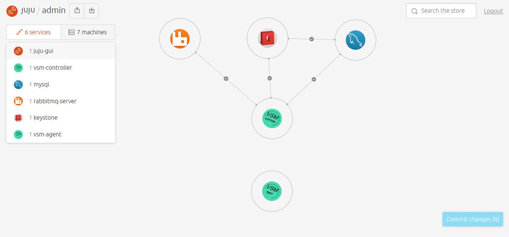
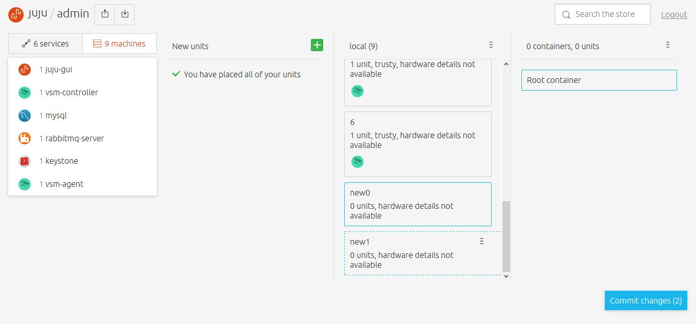
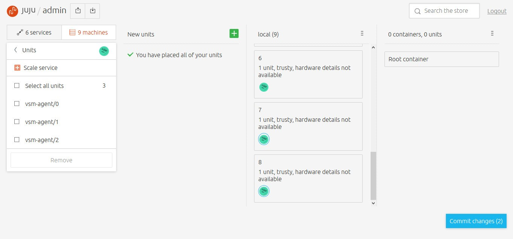
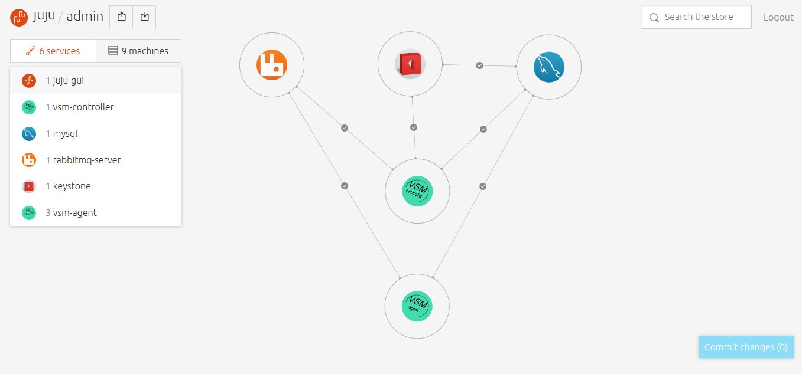
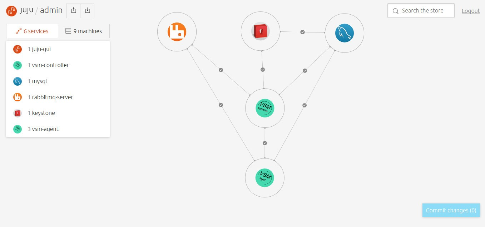

# charm-vsm-agent
Charm of juju for Virtual-Storage-Manager(VSM) Agent.
- VSM consists of vsm-controller and vsm-agent nodes.
- The charm aims to deploy the vsm-agent with vsm-agent and vsm-physical.

### Prepare
* OS: ubuntu 14.04.3
* Juju: 1.25.5-trusty-amd64
* You should install the juju by youself at first [juju](https://jujucharms.com/).
* You have deploy the [vsm-controller](https://github.com/flyingfish007/charm-vsm-controller)

### Steps by Steps
* login as root, then create an account for juju to use.
```sh
# useradd -m -s /bin/bash testuser
# passwd testuser
# su - testuser
```
* create directory for charm-vsm-agent and git clone from [charm-vsm-agent](https://github.com/flyingfish007/charm-vsm-agent)
```sh
$ mkdir -p charms/trusty
$ cd charms/trusty
$ git clone https://github.com/flyingfish007/charm-vsm-agent.git
$ mv charm-vsm-agent vsm-agent
```
* deploy vsm-agent
```sh
$ juju deploy --repository=$HOME/charms local:trusty/vsm-agent
```
* you can use command 'juju debug-log' to see whether the deployment has been done.
* after you do as above, you can see that.  

* add new machine.  

* scale the vsm-agent by 2.  

* add relation between vsm-agent and mysql and vsm-agent and rabbitmq-server.  

* add relation between vsm-agent and vsm-controller.  
